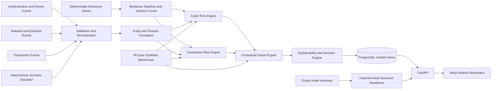

# RiskWeave AI — Architecture

## Stack

- Frontend: React, strict TypeScript, Vite, Tailwind CSS with semantic tokens, Radix primitives, Recharts, TanStack Query, React Router
- Backend: Python 3.12, FastAPI, Pydantic 2, SQLAlchemy 2, Alembic, psycopg
- Database: PostgreSQL only; Docker locally and Supabase PostgreSQL in deployment
- Intelligence: transparent rules, fixed-seed Isolation Forest, entity/session correlation, contextual fusion, explainability
- Local runtime: Docker Compose
- Verification: pytest, Ruff, mypy, Vitest, Testing Library, Playwright, accessibility checks

## High-level architecture



Quantum readiness is returned alongside channel context but never feeds the fraud-risk engines.

## Repository layout

```text
riskweave-ai/
├── frontend/
├── backend/
├── risk_engine/
├── simulator/
├── data/
│   ├── seeds/
│   ├── schemas/
│   └── benchmark/
├── docs/
├── scripts/
├── tests/
├── AGENTS.md
├── PROJECT_DECISIONS.md
├── SPEC.md
├── ARCHITECTURE.md
├── DATA_SCHEMA.md
├── UI_SYSTEM.md
├── SECURITY.md
├── DEMO_SCENARIOS.md
├── ACCEPTANCE_TESTS.md
├── DEPLOYMENT.md
├── CODEX_START_PROMPT.md
├── README.md
├── docker-compose.yml
├── .env.example
└── .gitignore
```

## Runtime boundaries

- Route handlers authenticate, authorize, validate, and delegate.
- Application services coordinate transactions and use cases.
- Repository objects perform database access.
- `risk_engine` contains scoring, anomaly, correlation, fusion, and explanation logic and has no frontend dependency.
- The frontend treats scores, severity, recommendations, and benchmark results as server-owned values.
- Scenario and benchmark fixtures are versioned data, not hard-coded component values.

## Data flow

1. Atomic reset loads the fixed 14-day background dataset.
2. A scenario run emits deterministic synthetic events with UUIDv5 identifiers.
3. Backend Pydantic schemas validate event-specific payloads.
4. Normalization persists raw events separately from derived incidents.
5. Correlation selects matching events inside the inclusive 30-minute pre-transaction window.
6. Cyber and transaction rule engines calculate separate primary scores.
7. The fixed-seed Isolation Forest may add 0–10 anomaly points to each stream.
8. Fusion applies the fixed weights and eligible cross-domain bonuses.
9. Explainability creates stable reason codes and concrete descriptions.
10. Decision logic maps the fused score to severity and recommended action.
11. Incident, contributions, timeline references, recommendation, and audit event are stored atomically.
12. Frontend retrieves the stored values through APIs and never recalculates them.

## Risk formula

```text
unrounded_fused_score =
    0.45 × cyber_score
  + 0.45 × transaction_score
  + correlation_bonus

fused_score = round_half_up(clamp(unrounded_fused_score, 0, 100))
```

Rules:

- cyber and transaction scores are individually clamped to 0–100;
- correlation bonus is clamped to 0–18;
- rounding happens once on the backend;
- no frontend score calculation is permitted.

## Decision thresholds

| Score | Severity | Response | Transaction state |
|---:|---|---|---|
| 0–19 | Low | Allow | `permitted` |
| 20–39 | Guarded | Allow and monitor | `permitted` |
| 40–59 | Elevated | Step-up verification | `pending` |
| 60–79 | High | Hold for analyst review | `held` |
| 80–100 | Critical | Hold transaction and open critical incident | `held` |

## Correlation contract

For a transaction at `transaction_time`, include an event only when:

```text
transaction_time - 30 minutes <= event_time <= transaction_time
```

The event must match `customer_id`, `account_id`, and `session_id`. `device_id` is also checked when present. Future, mismatched, and out-of-window events are excluded. A correlation bonus requires every signal named by a documented cross-domain interaction rule and is capped at 18. A bonus is never added or tuned merely to reach a preferred score, severity, or action.

## API outline

- `POST /api/auth/login`
- `GET /api/auth/me`
- `GET /api/auth/admin-check` (Milestone 2 RBAC verification surface)
- `GET /api/dashboard/summary`
- `GET /api/dashboard/trends`
- `GET /api/incidents`
- `GET /api/incidents/{incident_id}`
- `PATCH /api/incidents/{incident_id}`
- `POST /api/incidents/{incident_id}/actions`
- `GET /api/scenarios`
- `POST /api/scenarios/{scenario_key}/run`
- `POST /api/scenarios/reset`
- `GET /api/customers/{customer_id}`
- `GET /api/accounts/{account_id}`
- `GET /api/quantum/assets`
- `GET /api/quantum/summary`
- `GET /api/benchmark/summary`
- `GET /api/system/status` (admin only)
- `GET /api/audit-events` (admin only)
- `GET /health`
- `GET /ready`
