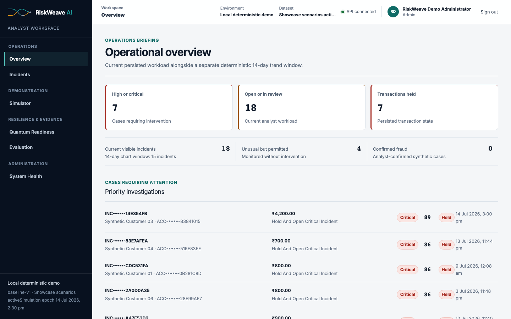
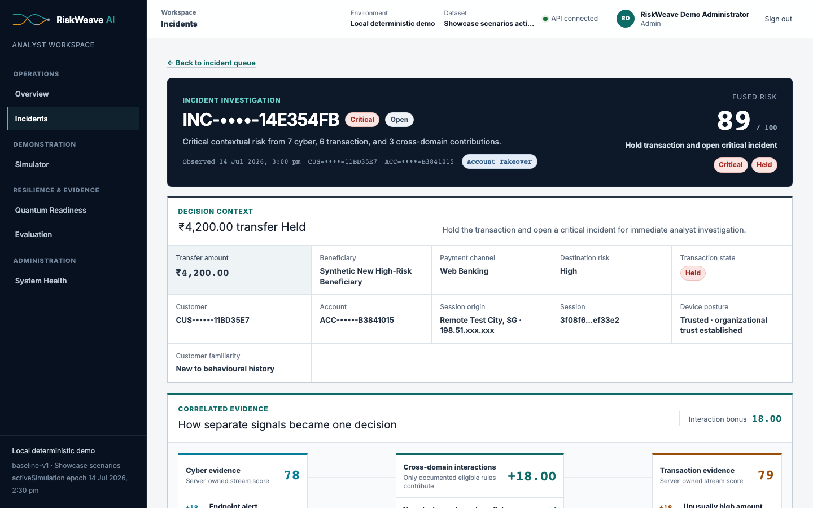
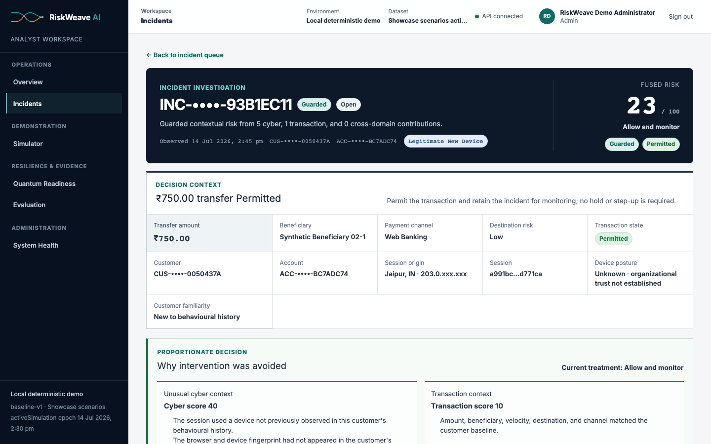
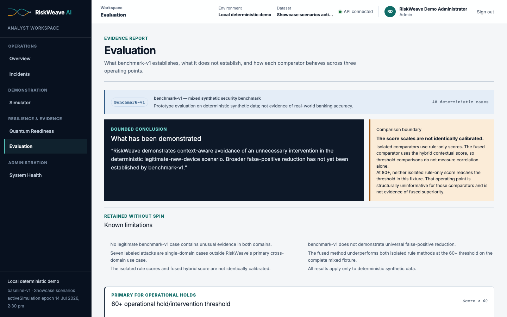
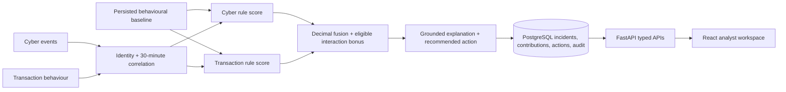

<p align="center">
  
</p>

<p align="center"><strong>Cyber intelligence. Financial confidence.</strong></p>

RiskWeave AI is an explainable cross-domain banking-risk prototype that correlates cybersecurity
telemetry with transaction behaviour to detect an account takeover followed by a fraudulent
transfer.

> FinSpark’26 — Problem Statement 2: AI-driven correlation of cybersecurity telemetry and
> transactional behaviour.

[](https://github.com/shreybansal365/riskweave-ai/actions/workflows/ci.yml)
[](LICENSE)
[](docs/SYNTHETIC_DATA.md)

## The decision RiskWeave makes

Fraud and security teams often see different fragments of the same attack. RiskWeave joins a
customer's eligible cyber events and transaction evidence by customer, account, session, and a strict
inclusive 30-minute window. The backend produces transparent rule contributions, bounded
fixed-seed anomaly support, documented interaction bonuses, one fused decision, and a grounded
explanation. The browser renders those persisted values; it never recreates the scoring model.

The result is an analyst workspace that answers three questions quickly:

1. What happened across identity, device, network, beneficiary, and transaction activity?
2. Which persisted signals produced the decision, and how were they paired?
3. What proportionate action should the analyst take next?

## Deterministic showcase

| Scenario              | Cyber | Transaction | Interaction |  Fused | Outcome                                                |
| --------------------- | ----: | ----------: | ----------: | -----: | ------------------------------------------------------ |
| Normal Activity       |    10 |          10 |           0 |  **9** | Low · allow · transaction permitted                    |
| Legitimate New Device |    40 |          10 |           0 | **23** | Guarded · allow and monitor · transaction permitted    |
| Account Takeover      |    78 |          79 |          18 | **89** | Critical · hold transaction and open critical incident |

Scenario B is intentional: a technically unusual login is visible without creating an unnecessary
hold or step-up challenge. Scenario C shows cyber and transaction evidence converging into one
critical intervention. All records are synthetic, UUIDv5-stable, seed `26026`, and anchored to the
fixed UTC simulation epoch `2026-07-14T09:00:00Z`.

## Product evidence

### Operational overview



### Account Takeover — Decision Weave



### Legitimate New Device — guarded and permitted



### Transparent synthetic evaluation



## Architecture



The fusion formula is `0.45 × cyber + 0.45 × transaction + eligible interaction bonus`, clamped to
0–100 and rounded once on the backend with `ROUND_HALF_UP`. Rules remain primary. Isolation Forest
support is deterministic, capped at 10 points per stream, explainable through observable deviations,
and cannot independently trigger an intervention.

## Run locally with Docker

Prerequisites: Docker Engine (or Colima) and Docker Compose v2.

```bash
cp .env.example .env
# Set JWT_SECRET, DEMO_ADMIN_PASSWORD and DEMO_ANALYST_PASSWORD in .env.
# Never commit that file or reuse hosted credentials.

docker compose up --build -d
docker compose exec backend python -m app.cli.seed_demo_users
docker compose exec backend python -m app.cli.reset_demo_data
```

Open <http://localhost:4173/login>. Sign in with either synthetic email and the corresponding
password you set in `.env`:

- `DEMO_ANALYST_EMAIL` / `DEMO_ANALYST_PASSWORD`;
- `DEMO_ADMIN_EMAIL` / `DEMO_ADMIN_PASSWORD`.

The repository intentionally publishes no reusable demo password. JWTs are short lived and held only
in browser memory, so a hard refresh requires authentication again.

Health checks:

```bash
curl --fail http://localhost:8000/health
curl --fail http://localhost:8000/ready
```

Run the showcase:

```bash
docker compose exec backend python -m app.cli.run_scenario normal_activity
docker compose exec backend python -m app.cli.run_scenario legitimate_new_device
docker compose exec backend python -m app.cli.run_scenario account_takeover
```

Reset restores exactly 15 background incidents and fingerprint
`2ac2c997d21246cc7380ce1f53e121bb58c79891ea98229e47e6f2ec998ef0ca`; replaying all three
scenarios produces exactly 18 visible incidents.

## Stack

- React 19, TypeScript 5.9, Vite 8, TanStack Query, Recharts;
- FastAPI, Pydantic, SQLAlchemy 2, Alembic, Argon2id, PyJWT;
- transparent Python rules plus fixed-seed scikit-learn Isolation Forest support;
- PostgreSQL 17 locally; PostgreSQL is the only runtime database;
- Vitest, Testing Library, Playwright, axe, pytest, Ruff, mypy, ESLint, Prettier;
- Docker Compose and GitHub Actions;
- locally bundled Inter Variable under SIL OFL 1.1—no runtime font CDN.

All runtime and development dependencies are exactly pinned in the committed lockfiles.

## Verification

```bash
make format-check
make lint
make typecheck
make test
make build
make audit
make test-e2e-chromium
```

The repository enforces at least 90% backend branch coverage and runs frontend coverage, PostgreSQL
integration tests, migration drift checks, deterministic scenario/reset tests, browser accessibility,
and supported 1440×900, 1280×720, and 1024×768 viewport checks. The full verification and browser
matrix are documented in [End-to-end testing](docs/END_TO_END_TESTING.md).

## Honest evaluation boundary

`benchmark-v1` is a 48-case **mixed synthetic security benchmark**. It reports isolated cyber rule,
isolated transaction rule, and fused hybrid contextual scores at 40+, 60+, and 80+ operating points,
including unfavorable results. It does not demonstrate universal false-positive reduction, and the
score scales are not identically calibrated.

> RiskWeave demonstrates context-aware avoidance of an unnecessary intervention in the deterministic
> legitimate-new-device scenario. Broader false-positive reduction has not yet been established by
> benchmark-v1.

See [Benchmark methodology and limitations](docs/BENCHMARK.md).

## Security and product boundaries

- synthetic data only; no real customer or banking data;
- Argon2id password hashing, short-lived JWTs, server-side RBAC, request IDs, safe production errors,
  explicit CORS, security headers, and append-oriented audit events;
- deterministic interaction provenance is backend-authored from persisted contributions;
- quantum readiness is a separate migration-priority register and never modifies fraud risk;
- no paid AI API, opaque LLM explanation, active quantum-attack claim, or real-world accuracy claim;
- the hosted Free-tier release is a demonstration, not production banking infrastructure.

Read [Security](SECURITY.md), [Risk scoring](docs/RISK_SCORING.md), and
[Deployment and recovery](DEPLOYMENT.md) for the complete contracts.

## Repository map

```text
backend/                  FastAPI, domain model, risk intelligence, migrations, tests
frontend/                 React analyst workspace, public brand assets, unit/E2E tests
docs/                     API, security, evaluation, design, deployment, and visual evidence
.github/workflows/ci.yml  Pinned GitHub Actions quality gates
docker-compose.yml        Local frontend + backend + PostgreSQL
docker-compose.browser.yml  Isolated Firefox/WebKit release-test frontend
render.yaml               Render backend blueprint
vercel.json               Vercel SPA and security-header configuration
```

The authoritative implementation read order begins in [AGENTS.md](AGENTS.md). API routes are listed
in [docs/API.md](docs/API.md).

## Credit and FinSpark submission

**Built and maintained by Shrey Bansal.**

Submitted to FinSpark’26 under the registered team **CyberForge**: Shrey Bansal, Anureet Kaur,
Aryaman Saraswat, and Anushka Dutta. This line records registered submission membership and does not
assign Git authorship or invent individual technical contributions.

## Licence and brand

Source code and documentation are licensed under [Apache License 2.0](LICENSE). Third-party notices
are in [THIRD_PARTY_NOTICES.md](THIRD_PARTY_NOTICES.md).

The **RiskWeave AI** name, Concept A logo, wordmark, favicon, and associated brand assets are reserved
and are not licensed for independent reuse under Apache-2.0. See [NOTICE](NOTICE) and the
[brand guidelines](docs/BRAND_GUIDELINES.md).
